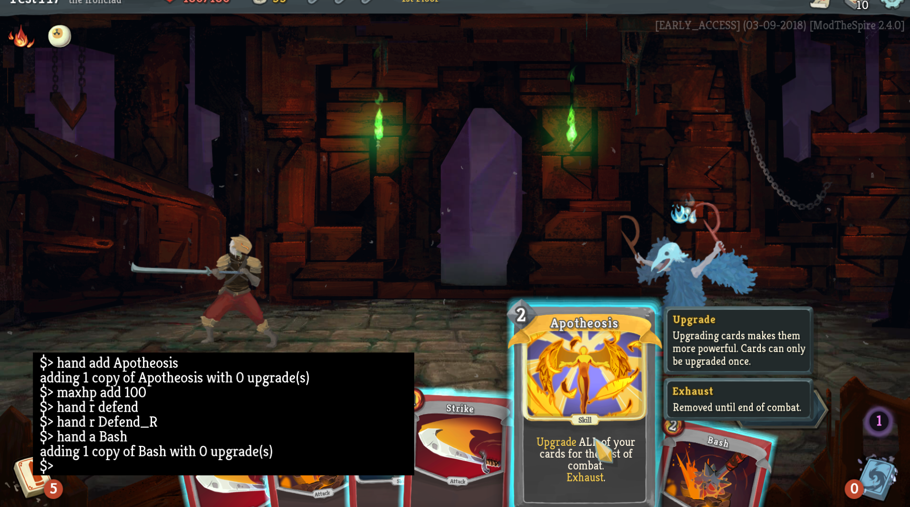

# BaseMod #
BaseMod provides a number of hooks and a console.

## Requirements ##
#### General Use ####
* **Java 8 (do not use Java 9 - ModTheSpire does not work on Java 9)**
* ModTheSpire v3.1.0+ (https://github.com/kiooeht/ModTheSpire/releases)

#### Development ####
* Java 8
* Maven
* ModTheSpire (https://github.com/kiooeht/ModTheSpire)

## Building ##
1. (If you haven't already) `mvn install` ModTheSpire Altenatively, modify pom.xml to point to a local copy of the JAR.
2. Copy `desktop-1.0.jar` from your Slay the Spire folder into `../lib` relative to the repo.
3. Run `mvn package`

## Installation ##
1. Copy `target/BaseMod.jar` to your ModTheSpire mods directory. Maven will automatically do this after packaging if your mods directory is located at `../_ModTheSpire/mods` relative to the repo.

# Wiki
Take a look at the wiki (https://github.com/daviscook477/BaseMod/wiki) to get started using BaseMod as either a console or a modding platform!

## Console ##
Take a look at the Console page on the wiki (https://github.com/daviscook477/BaseMod/wiki/Console) to start using the console to test things out!

## Known Issues ##
* If you use the console to `fight` an enemy or spawn an `event` in the starting room with Neow your save will be unloadable. Please refrain from using those commands until after leaving the starting room.
* If you use the `event` command with an invalid ID it will crash the game.
* BaseMod is likely to break when weekly patches hit. This means that if it's Thursday or Friday and things suddenly stop working you'll probably need to wait for an updated version of BaseMod in a day or two :)

## Roadmap ##
* Keep up-to-date with weekly patches to keep mods useable
* More tools/more intuitive tools for mods to create custom UIs
* Have a feature request? Make an issue: (https://github.com/daviscook477/BaseMod/issues)

## For Modders ##

### Hooks ###
Take a look here for the hooks that are available (https://github.com/daviscook477/BaseMod/wiki/Hooks)

### Mod Badges ###
Take a look here for how to set up a Mod Badge (https://github.com/daviscook477/BaseMod/wiki/Mod-Badges)